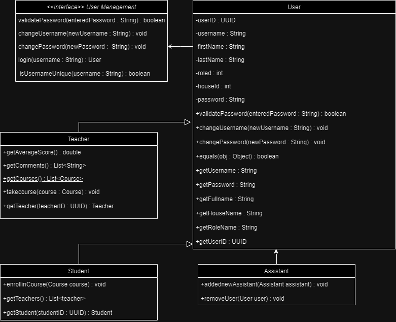

# Hogwarts School of Witchcraft and Wizardry

A program for the school of witchcraft and wizardry, Hogwarts to manage their houses, courses, users which include teachers and students

## Description

Anyone in Hogwarts is able to use this program to manage their activities. From teachers who form courses and score students to students who attend classes and want to see their scores or admins who control everything.

## Getting Started

### Dependencies
* IntelliJ for running the code
* Gradle as package manager
* "org.junit.jupiter:junit-jupiter"
* "org.junit:junit-bom:5.9.1"
* "commons-codec:commons-codec:1.16.1" for hashing passwords

### Installing

* The app can be cloned from [*GitHub*](https://github.com/SrgtSajjad/AP-Third-Assignment-Hogwarts.git)
* Download Gradle 8.6 from [*Gradle*](https://gradle.org/releases/)
* Download IntelliJ IDEA community version from [*JetBrains*](https://www.jetbrains.com/idea/download/)
* Download Java from [*Oracle*](https://www.oracle.com/java/technologies/downloads/)

### Executing program

1. Run the program using IntelliJ
2. Sign up as yourself and wait for an admin to let you in and confirm your access! or log in as a character
3. As an admin you can mangae everything! courses, teachers, students, and all!
4. As a teacher you can take the courses and score students in it
5. As a student you can participate in courses and view your scores and comment teachers
* * *
## UML diagram

1. 

* * * 
## Author

Armita Mehri
[@armitaswan-temporary](https://github.com/armitaswan-temporary)